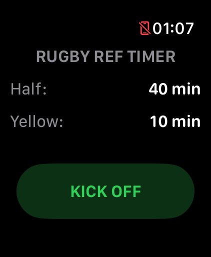
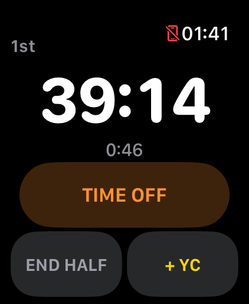
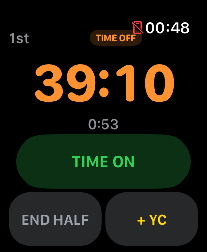
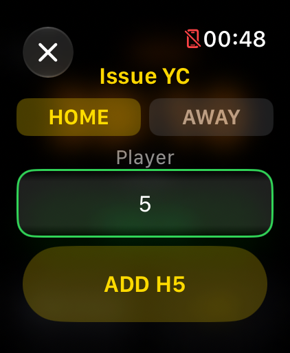
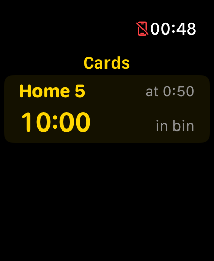
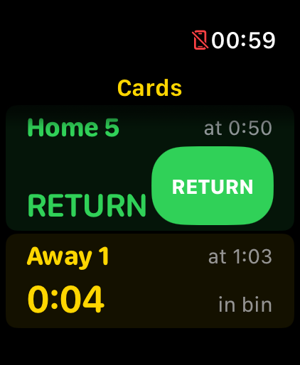
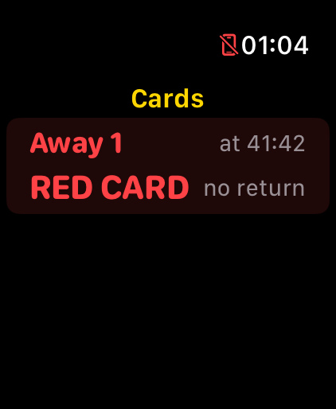

# Rugby Ref Timer User Guide

Rugby Ref Timer is an Apple Watch app for rugby referees. It helps you track playing time, actual elapsed time, time-off periods, halves, and yellow-card countdowns from your wrist.

The app is designed to be simple, clear, and usable during a live rugby match.

---

## What the App Tracks

Rugby Ref Timer focuses on match timing and discipline timing.

It can help you track:

- Remaining playing time in each half
- Actual elapsed time since the half started
- Time-off periods
- First and second half timing
- Yellow-card / sin-bin countdowns
- Red cards caused by a second yellow card
- A full-time summary of cards issued during the match

The app does **not** keep score and does **not** manage teams, players, or match reports. There are other apps that can do this. Rugby Ref Timer is designed for referees who use a physical scorecard.

---

## Pre-Match Setup

Open Rugby Ref Timer on your Apple Watch.

Before starting the match, select:

- The duration of each half, default: 40 minutes
- The yellow-card duration, default: 10 minutes

Half length can be set from 1 to 40 minutes.

Yellow-card length can be set from 1 to 10 minutes.

Use the Apple Watch controls, including the Digital Crown where shown, to adjust the values.

When ready, start the match from the pre-match screen.

---

## Starting a Match

Start the match timer when the half begins.

Once started, the main match screen shows:

- The remaining playing time in the current half
- The actual elapsed time since the half started
- Controls for time-off and match management

---

## Playing Time and Actual Elapsed Time

Rugby Ref Timer shows two different time values.

**Playing time** is the official match time being counted down for the current half. It excludes time-off periods.

**Actual elapsed time** is the real-world time since the half started. It continues during time-off.

This helps you keep track of both the official playing clock and the real elapsed time on the pitch.

---

## Managing Time-Off

When you call time-off, use the time-off control in the app.

During time-off:

- Playing time is paused
- Remaining time for any active yellow cards is paused
- Actual elapsed time continues

The app gives a haptic alert every 60 seconds while time is off to remind you that the match clock is paused.

When play resumes, use the **Time On** control to continue tracking playing time.

---

## Yellow Cards / Sin Bin Timing

Rugby Ref Timer includes yellow-card countdown support.

When a player receives a yellow card, use the **+YC** control.

You will be asked to choose:

- The team: Home or Away
- The player's number

Player numbers can be selected from 1 to 99.

The app then tracks the remaining sin-bin time while the match continues.

Yellow-card countdowns pause during time-off and resume when time is back on.

You can swipe between the main match timer screen and the cards screen.

---

## Cards Screen

The cards screen shows active disciplinary cards.

For an active yellow card, the app shows:

- The player
- The match time when the card was issued
- The remaining sin-bin time
- An “in bin” label while the timer is still running

When the yellow-card countdown has elapsed, the card is shown as ready to return.

Use the **RETURN** control to clear the player from the active card list when they are allowed back on.

---

## Second Yellow Cards and Red Cards

If the same player receives a second yellow card later in the match, the app records this as a red card.

A red card has no return-to-play countdown.

The cards screen shows red-carded players with:

- The player
- The match time when the red card was issued
- A **RED CARD** label
- A “no return” label

---

## Half-Time and Second Half

Use the half controls to manage the first and second half.

At the end of the first half, use the **End Half** control.

At half-time, the app can still show the cards screen, so you can review any cards issued.

When the second half begins, start timing again.

---

## Full-Time

When you end the second half, the app shows a summary of cards issued during the game.

The summary includes the cards issued and the match time at which they occurred.

---

## Suggested Match Workflow

1. Open Rugby Ref Timer before kick-off.
2. Select the half duration and yellow-card duration.
3. Start the timer when the first half begins.
4. Use time-off whenever you stop the match clock.
5. Use **Time On** when play restarts.
6. Use **+YC** when a yellow card is issued.
7. Choose the team and player number.
8. Swipe to the cards screen to monitor active sin-bin timers.
9. Use **RETURN** when a yellow-carded player is allowed back on.
10. Use **End Half** at the end of the first half.
11. Start timing again when the second half begins.
12. End the second half to view the full-time card summary.

---

## Tips

- Open the app before the match starts.
- Make sure your Apple Watch has enough battery before kick-off.
- Keep the watch display easy to access during the game.
- Practise using the controls before using it in a live match.
- Rugby Ref Timer should support your refereeing, not replace your judgement or official match procedures.
- Continue to use your official competition procedures and any physical scorecard required for the match.

---

## Troubleshooting

### The app is not showing on my Apple Watch

Make sure the app is installed on your Apple Watch. You may need to install it from the Watch app on your iPhone or from the App Store on Apple Watch.

### The timer is not behaving as expected

Close and reopen the app. If the issue continues, contact support with details of what happened.

### I cannot select a player number for a yellow card

A player number will be unavailable if that player is already in the sin bin or has already received a red card.

### I found a bug or have feedback

Please contact:

**Email:** eoin@seapointrugby.com

---

## Privacy

Rugby Ref Timer does not require an account and does not collect personal data.

Read the full privacy policy here:

[Privacy Policy](./privacy)

---

## Support

For support, feedback, or bug reports, contact:

**Email:** eoin@seapointrugby.com
